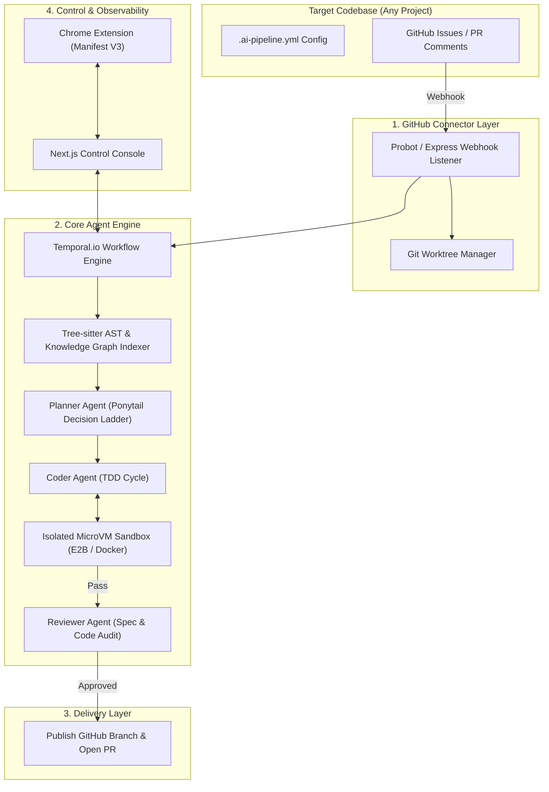

# Enterprise AI Pipeline Platform (Zero-to-Production Blueprint)

[](LICENSE)
[](https://nodejs.org)
[](https://www.python.org)
[](https://pnpm.io)
[](https://nextjs.org)
[](https://ollama.com)

An enterprise-grade, zero-touch autonomous AI engineering platform that transforms natural language requirements, GitHub/Jira issues, and specification documents into fully verified, test-proven GitHub Pull Requests.

---

## ⚡ 60-Second Setup Guide (How to Use on ANY Repository)

Connecting this AI Pipeline to **your repository** takes **less than 60 seconds** with **ZERO code required**:

### 1️⃣ Step 1: Copy `.ai-pipeline.yml` to Your Repo Root *(30 Seconds)*
Create **1 single file** named `.ai-pipeline.yml` in the root directory of your project:

```yaml
version: "1.0"
pipeline:
  repository: "your-username/your-repo-name"
  base_branch: "main"

  sandbox:
    isolation: "docker" # docker | e2b | process
    timeout_seconds: 300

  guardrails:
    ponytail_strict: true # Enforces YAGNI & minimal diff checks
    max_diff_lines: 500

  agents:
    planner_model: "ollama/llama3" # Or "ollama/qwen2.5-coder"
    coder_model: "ollama/llama3"
    reviewer_model: "ollama/llama3"

  github:
    auto_pr: true
    trigger_label: "ai-build"
    comment_trigger: "@ai-pipeline fix"
```

### 2️⃣ Step 2: Add Webhook to Your GitHub Repository *(30 Seconds)*
1. Go to your repository settings on GitHub:
   👉 **`https://github.com/your-username/your-repo/settings/hooks`**
2. Click **Add webhook**.
3. Fill in these settings:
   - **Payload URL**: `https://smee.io/KShRqrPDcgLv6` *(or your server URL)*
   - **Content type**: `application/json`
   - **Which events?**: Select **"Let me select individual events"** $\rightarrow$ Check **Issues** and **Issue comments**.
4. Click **Add webhook**.

### 3️⃣ Step 3: Create an Issue & Add `ai-build` Label 🎉
- Create any Issue on your GitHub repo (e.g. *"Add JWT validation middleware"*).
- Add the **`ai-build`** label.
- The platform automatically scans your repo, writes TDD unit tests, and **opens a ready-to-merge Pull Request**!

---

## 🌟 Executive Overview & Key Features

### 🛡️ 100% Safe & Non-Invasive
- **Zero Risk to `main`**: The AI **never writes directly to your `main` branch**.
- **Isolated Branching**: All work takes place in dynamic branches (`ai/feat-ISSUE-<id>`).
- **Pull Request Safety Gate**: Code is delivered as a Pull Request with complete TDD test reports for human review.

### 🦙 100% Free & Private Local AI Support
- **$0 Cost Forever**: Compatible with **Ollama** (`ollama/llama3`, `ollama/qwen2.5-coder`, `ollama/deepseek-coder`).
- **100% Offline & Private**: Code processing stays on your machine with zero data sent to external cloud APIs.

---

## 🏗️ System Architecture



---

## 📂 Monorepo Structure

```text
.
├── packages/
│   ├── engine/                 # Core engine (@enterprise-ai/engine): Temporal state machine, agents, guardrails
│   │   ├── src/
│   │   │   ├── agents/         # Planner, TDD Coder, and Reviewer agents
│   │   │   ├── guardrails/     # Ponytail Decision Ladder rules
│   │   │   ├── sandbox/        # MicroVM container runner
│   │   │   ├── types/          # TypeScript interfaces
│   │   │   └── workflows/      # Temporal pipeline workflow logic
│   │   └── tests/              # Engine unit test suites
│   ├── graph-indexer/          # Tree-Sitter AST + Knowledge Graph hybrid search indexer (Python)
│   │   ├── src/
│   │   │   ├── ast_parser.py   # Multi-language symbol parser
│   │   │   ├── graph_builder.py# Zero-dependency DiGraph call dependency builder
│   │   │   └── hybrid_search.py# Lexical + Graph Centrality search engine
│   │   └── tests/              # Python unittest suite
│   └── github-connector/       # Probot GitHub App and Webhook connector
│       ├── src/
│       │   ├── webhooks/       # Issue labeling & PR comment event handlers
│       │   ├── worktree/       # Git worktree branch isolation manager
│       │   ├── server.ts       # Express & Smee.io webhook server
│       │   └── pr_publisher.ts # GitHub Pull Request publisher
│       └── tests/              # Connector integration tests
├── apps/
│   ├── control-console/        # Next.js 15 App Router Management Dashboard
│   │   ├── app/
│   │   │   ├── (dashboard)/    # Live workflow visualizer & interactive DAG
│   │   │   ├── settings/       # Visual .ai-pipeline.yml config editor
│   │   │   └── api/            # API endpoints for workflow triggers
│   ├── browser-extension/      # Manifest V3 Chrome Extension
│   │   ├── manifest.json       # Chrome MV3 manifest configuration
│   │   └── src/
│   │       ├── contents/       # GitHub/Jira DOM overlay action buttons
│   │       └── background/     # Service worker background API client
├── scripts/
│   └── e2e_dry_run.ts          # End-to-End dry run execution script
├── pnpm-workspace.yaml         # PNPM workspace configuration
├── package.json                # Monorepo root package definition
└── README.md
```

---

## 📜 Ponytail Decision Ladder

All code modifications generated by the platform are evaluated against the **Ponytail Decision Ladder**:

1. **YAGNI (You Aren't Gonna Need It)**: Reject unrequested abstractions or unnecessary dependencies.
2. **Standard Library First**: Prefer native APIs (`node:*`, Python stdlib) over heavy external packages.
3. **Platform Native**: Utilize underlying container, process isolation, and OS capabilities.
4. **Existing Dependencies**: Reuse pre-installed dependencies before adding new ones.
5. **Minimal Diff**: Restrict diff size and enforce line-targeted modifications verified by tests.

---

## 💻 Running the Platform Locally

### 1. Run Automated Test Suites & Dry Run

```bash
# Clone repository
git clone https://github.com/thienng-it/KobeanAgentic.git
cd KobeanAgentic
pnpm install

# Run Python Graph Indexer unit tests
python3 packages/graph-indexer/tests/test_indexer.py

# Run 1-Command E2E Dry Run Execution Script
node --experimental-strip-types scripts/e2e_dry_run.ts
```

### 2. Launch Next.js Management Control Console

```bash
npx pnpm --filter @enterprise-ai/control-console dev
```
Open **`http://localhost:3001`** in your browser to view active workflows, live logs, and the interactive Temporal Workflow DAG.

---

## 📄 License

This project is licensed under the MIT License - see the [LICENSE](LICENSE) file for details.
