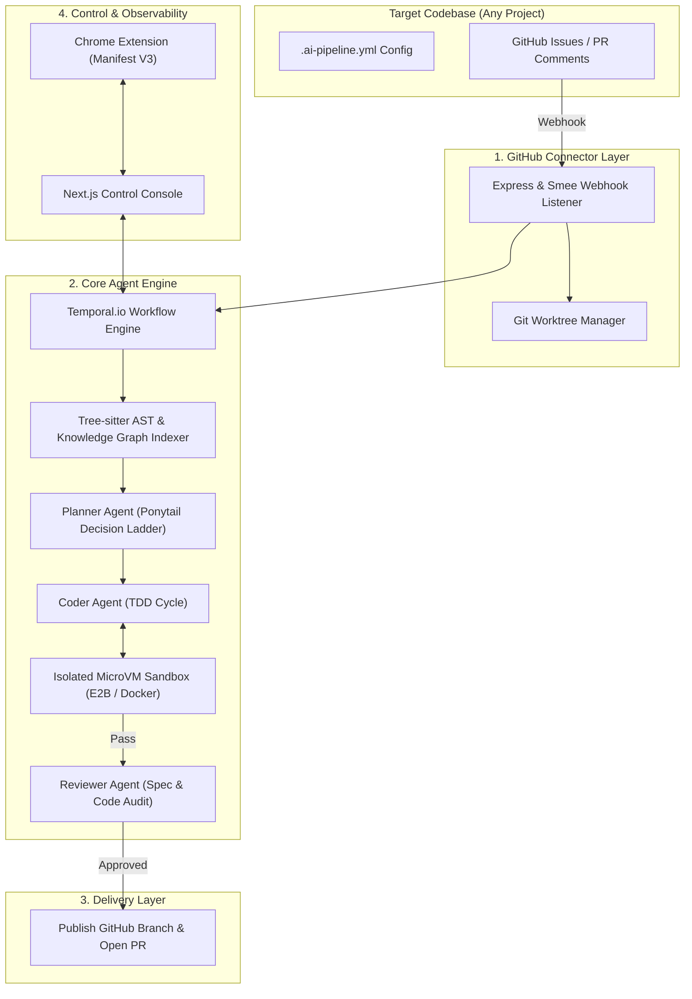

# 🚀 Enterprise AI Pipeline Platform

[](LICENSE)
[](https://www.npmjs.com/package/@josephnguyent/kobean-agentic)
[](https://nodejs.org)
[](https://www.python.org)
[](https://pnpm.io)

An enterprise-grade, zero-touch autonomous AI engineering platform that transforms GitHub issues into verified, test-proven Pull Requests automatically.

---

## ⚡ 1-Command Setup (Run Anywhere)

Run **1 single command** in your terminal to set up any GitHub repository automatically:

```bash
npx @josephnguyent/kobean-agentic@latest setup
```

---

## 📌 How It Works (3 Steps)

1. **Run Setup**:
   ```bash
   npx @josephnguyent/kobean-agentic@latest setup
   ```
2. **Enter Your Target Repo** when prompted in terminal:
   ```text
   👉 Enter your target GitHub repository: thienng-it/KobeanREST
   ```
3. **Create an Issue & Add `ai-build` Label** 🎉
   - Create an Issue on GitHub $\rightarrow$ Add label **`ai-build`**.
   - The AI automatically writes the code, runs unit tests, and **opens a ready-to-merge Pull Request**!

---

## 🔒 Security, Privacy & Universal AI

- **$0 Free & 100% Private**: Automatically uses your local installed AI model via Ollama (`llama3`, `qwen2.5-coder`, `gemma3:12b`, `mistral-nemo`).
- **Cloud AI API Keys (Optional)**: Set `OPENAI_API_KEY`, `ANTHROPIC_API_KEY`, `GEMINI_API_KEY`, or `DEEPSEEK_API_KEY` to use cloud models.
- **Automated Webhooks**: Auto-creates dedicated Smee.io Webhook proxy channels programmatically.
- **Self-Correction & Memory**: Automatically self-repairs code diffs and remembers past issue resolutions.

---

## 🏗️ System Architecture



---

## 📄 License

This project is licensed under the MIT License - see the [LICENSE](LICENSE) file for details.
