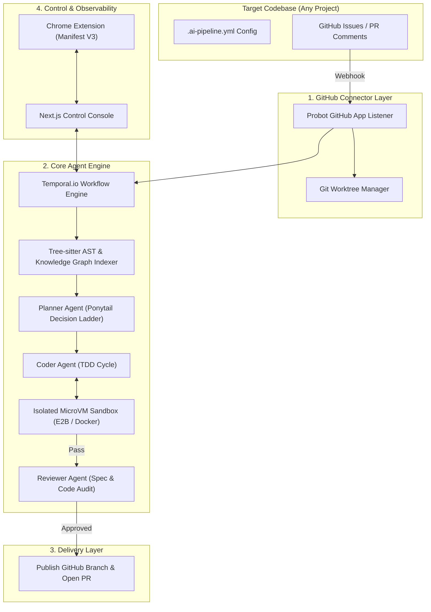

# Enterprise AI Pipeline Platform (Zero-to-Production Blueprint)

[](LICENSE)
[](https://nodejs.org)
[](https://www.python.org)
[](https://pnpm.io)
[](https://nextjs.org)
[](https://temporal.io)

An enterprise-grade, zero-touch autonomous AI engineering platform that transforms natural language requirements, GitHub/Jira issues, and specification documents into fully verified, test-proven GitHub Pull Requests.

---

## 🌟 Executive Overview & Vision

The **Enterprise AI Pipeline Platform** bridges the gap between issue reporting and production-ready code delivery. Functioning as a zero-touch repository plugin, it continuously monitors GitHub issues and PR comments, indexes repository context via AST graph parsing, orchestrates Test-Driven Development (TDD) cycles inside isolated MicroVM sandboxes, and enforces strict engineering guardrails before publishing Pull Requests.

### Key Highlights
- 🤖 **Zero-Touch GitHub Connector**: Listens for `ai-build` issue labels and `@ai-pipeline fix` PR comments.
- 🌳 **Tree-Sitter AST & Knowledge Graph**: Fast code indexer combining AST symbol extraction with graph degree centrality for high-precision prompt context retrieval.
- ⚡ **Temporal.io Workflow Engine**: Durable, fault-tolerant orchestration driving multi-agent planning, coding, and code audits.
- 🛡️ **Ponytail Decision Ladder**: Embedded engineering guardrail system enforcing **YAGNI** $\rightarrow$ **StdLib** $\rightarrow$ **Platform Native** $\rightarrow$ **Existing Deps** $\rightarrow$ **Minimal Diff**.
- 🧪 **Isolated Sandbox TDD Runner**: Runs automated TDD execution cycles (RED $\rightarrow$ GREEN) inside E2B / Docker microVMs.
- 📊 **Next.js 15 Control Console**: Sleek dark-mode management plane featuring an interactive Temporal Workflow DAG visualizer, live execution logs, and `.ai-pipeline.yml` editor.
- 🧩 **Manifest V3 Chrome Extension**: Inject action buttons ("🚀 Run AI Pipeline") directly into GitHub and Jira headers.

---

## 🏗️ System Architecture



---

## 📂 Monorepo Structure

```text
.
├── packages/
│   ├── engine/                 # Temporal workflows, Agent prompts, MicroVM runner, Ponytail guardrails
│   │   ├── src/
│   │   │   ├── agents/         # Planner, TDD Coder, and Reviewer agent logic
│   │   │   ├── guardrails/     # Ponytail Decision Ladder evaluation engine
│   │   │   ├── sandbox/        # MicroVM container & command execution runner
│   │   │   ├── types/          # TypeScript contracts & interfaces
│   │   │   └── workflows/      # Temporal pipeline workflow state machine
│   │   └── tests/              # Engine unit test suites
│   ├── graph-indexer/          # Tree-Sitter AST + Knowledge Graph hybrid search indexer (Python)
│   │   ├── src/
│   │   │   ├── ast_parser.py   # Multi-language symbol & AST parser
│   │   │   ├── graph_builder.py# Zero-dependency DiGraph call dependency builder
│   │   │   └── hybrid_search.py# Lexical + Graph Centrality search engine
│   │   └── tests/              # Python unittest suite
│   └── github-connector/       # Probot GitHub App and Git automation
│       ├── src/
│       │   ├── webhooks/       # Issue labeling & PR comment event handlers
│       │   ├── worktree/       # Git worktree branch isolation manager
│       │   └── pr_publisher.ts # GitHub Pull Request publisher
│       └── tests/              # Connector integration tests
├── apps/
│   ├── control-console/        # Next.js 15 App Router Management Dashboard
│   │   ├── app/
│   │   │   ├── (dashboard)/    # Live workflow visualizer & interactive DAG
│   │   │   ├── settings/       # Visual .ai-pipeline.yml config editor
│   │   │   └── api/            # API endpoints for workflow triggers
│   │   └── public/
│   └── browser-extension/      # Manifest V3 Chrome Extension
│       ├── manifest.json       # Chrome MV3 manifest configuration
│       └── src/
│           ├── contents/       # GitHub/Jira DOM overlay action buttons
│           └── background/     # Service worker background API client
├── scripts/
│   └── e2e_dry_run.ts          # End-to-End dry run execution script
├── pnpm-workspace.yaml         # PNPM workspace configuration
├── package.json                # Monorepo root package definition
└── README.md
```

---

## 📜 Ponytail Decision Ladder

All code modifications generated by the platform are evaluated against the **Ponytail Decision Ladder**, preventing scope creep, bloated dependencies, and over-engineering:

1. **YAGNI (You Aren't Gonna Need It)**: Reject unrequested abstractions, extra utility wrappers, or unnecessary third-party packages.
2. **Standard Library First**: Prefer native APIs (`node:*`, Python stdlib) over heavy npm/pip packages.
3. **Platform Native**: Utilize underlying container, process isolation, and OS capabilities.
4. **Existing Dependencies**: Reuse pre-installed dependencies before adding new ones.
5. **Minimal Diff**: Restrict diff size and enforce line-targeted modifications verified by tests.

---

## 🚀 Quickstart & Installation

### Prerequisites

- **Node.js**: `>= 18.0.0` (Node v22+ recommended for native TS execution)
- **Python**: `>= 3.10`
- **pnpm**: `>= 8.0.0` (`npm i -g pnpm`)

### 1. Clone & Install Dependencies

```bash
git clone https://github.com/thienng-it/KobeanAgentic.git
cd KobeanAgentic

# Install monorepo workspace packages
pnpm install
```

### 2. Run Automated Test Suites

```bash
# Run Python Graph Indexer unit tests
python3 packages/graph-indexer/tests/test_indexer.py

# Run End-to-End Pipeline Dry Run Script
node --experimental-strip-types scripts/e2e_dry_run.ts
```

### 3. Launch Next.js Management Control Console

```bash
cd apps/control-console
pnpm dev
```
Navigate to `http://localhost:3000` to view the live dashboard and interactive workflow DAG.

### 4. Load Chrome Extension (Manifest V3)

1. Open Google Chrome and navigate to `chrome://extensions`.
2. Enable **Developer mode** in the top-right toggle.
3. Click **Load unpacked** and select the `apps/browser-extension` folder.
4. Open any GitHub Issue or Pull Request page to view the injected **🚀 Run AI Pipeline** overlay button.

---

## 🔧 Configuration (`.ai-pipeline.yml`)

Add a `.ai-pipeline.yml` manifest to any repository root to customize pipeline behavior:

```yaml
version: "1.0"
pipeline:
  sandbox:
    isolation: "e2b" # Options: e2b | docker | process
    timeout_seconds: 300
  guardrails:
    ponytail_strict: true
    max_diff_lines: 500
    allow_new_deps: false
  agents:
    planner_model: "gemini-3.6-pro"
    coder_model: "gemini-3.6-flash"
    reviewer_model: "gemini-3.6-pro"
  github:
    auto_pr: true
    trigger_label: "ai-build"
    comment_trigger: "@ai-pipeline fix"
```

---

## 🧪 End-to-End Verification Pipeline Output

```text
===========================================================
🚀 ENTERPRISE AI PIPELINE PLATFORM: END-TO-END DRY RUN
===========================================================

[1/4] Webhook Received: Issue #999 labelled with "ai-build"
[2/4] Indexing Codebase AST & Knowledge Graph (Python Tree-Sitter Indexer)...
  ✓ Python AST Parser extracted 12 symbols across repository.
  ✓ Knowledge Graph built 8 dependency call edges.
  ✓ Hybrid Search Engine matched top context symbol: "applyRateLimit"
[3/4] Running Temporal Workflow & MicroVM Sandbox TDD Cycle...

[4/4] Pipeline Result Verification:
  ✓ Issue ID:           ISSUE-999
  ✓ PR Branch:          ai/feat-ISSUE-999
  ✓ PR Title:           feat(ISSUE-999): Implement Resilient Rate Limiter Middleware
  ✓ TDD Verification:   Passed 2 TDD stages.

===========================================================
✅ END-TO-END DRY RUN COMPLETED SUCCESSFULLY!
===========================================================
```

---

## 📄 License

This project is licensed under the MIT License - see the [LICENSE](LICENSE) file for details.
